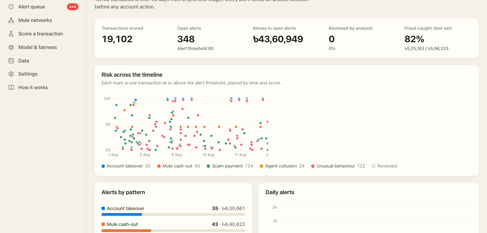
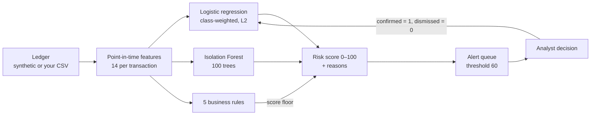
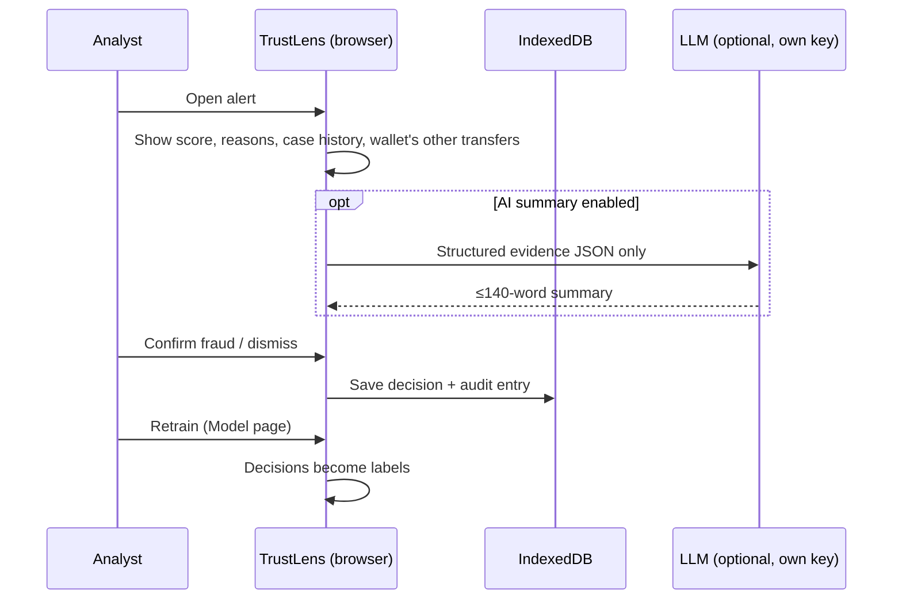
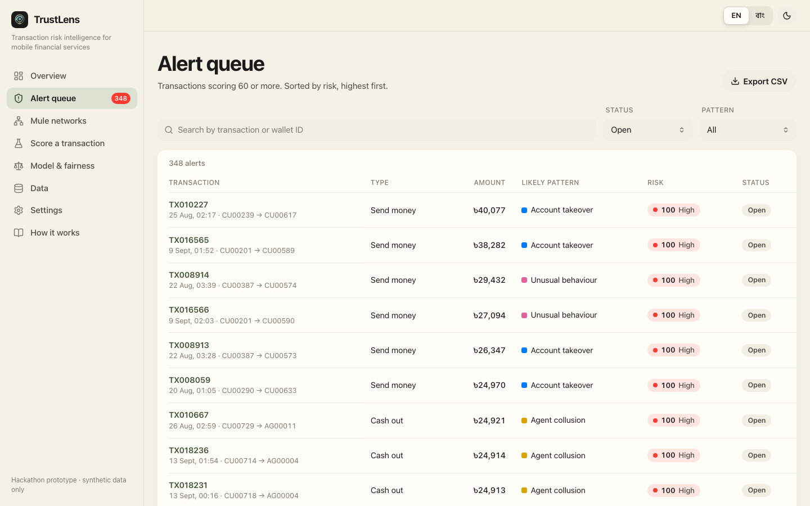
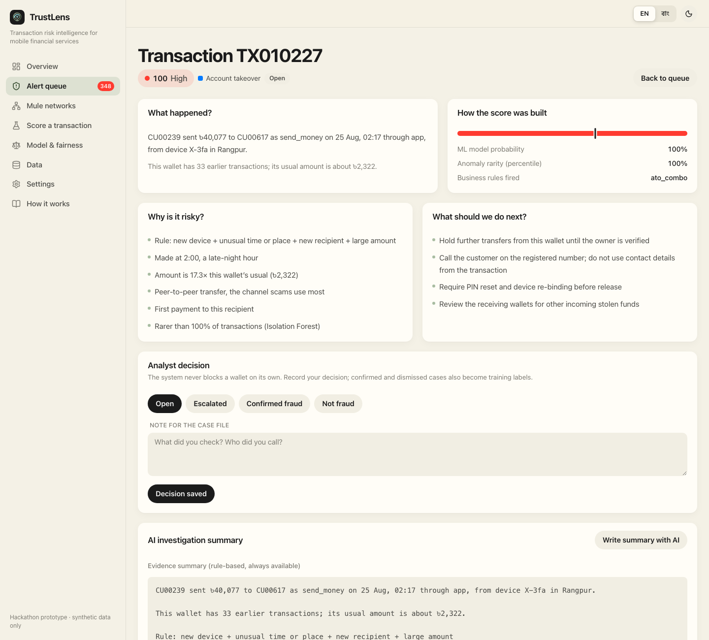
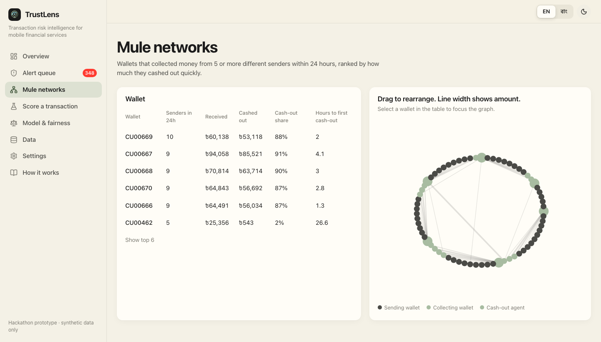
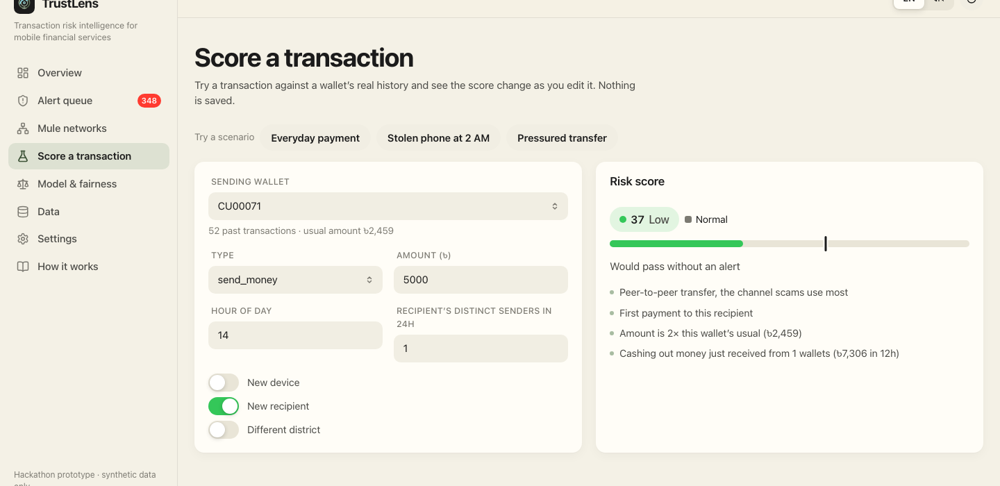
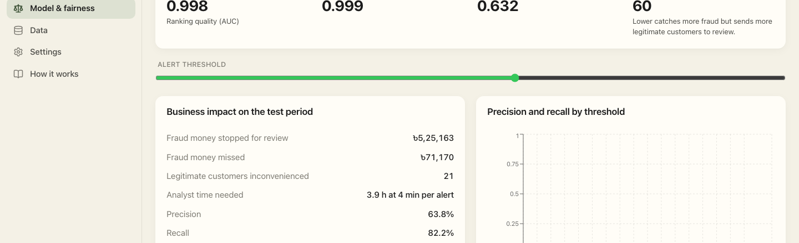
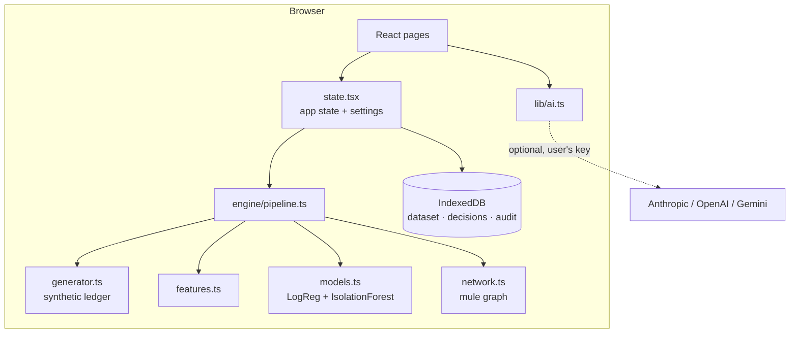

<div align="center">


# TrustLens

### A second pair of eyes on every mobile-money transfer, so analysts review the 1% that matters instead of the 99% that doesn't.


-a8bca1?style=flat-square)


[Quick start](#run-it-in-4-commands) · [How it works](#how-it-works) · [Results](#results) · [Demo](#3-minute-demo) · [Limits](#what-this-is-not)

</div>

---

> **Why is this hard?** Mobile financial services move huge numbers of small transfers, and fraud hides inside ordinary-looking ones: a stolen account cashed out at 2 a.m., a "mule" wallet that collects from strangers and empties itself within hours. Real customers also do odd things: they change phones and send one big transfer home. Hard rules either miss fraud or flood analysts with false alarms.

> **TrustLens answers one question:** *Which of today's transactions should a human look at first, and why?*

<table>
<tr>
<td align="center"><b>19,102</b><br/><sub>transactions scored in the browser</sub></td>
<td align="center"><b>0.998</b><br/><sub>AUC on the held-out last 30% of time</sub></td>
<td align="center"><b>82%</b><br/><sub>of test fraud caught at threshold 60</sub></td>
<td align="center"><b>৳5,25,163</b><br/><sub>of ৳5,96,333 fraud money stopped (test)</sub></td>
</tr>
</table>

<sub>All numbers come from the built-in synthetic ledger (seed 2026). They show the pipeline works; they don't predict real-world accuracy. See [Limits](#what-this-is-not).</sub>



---

## The problem and what we do

| Problem | What TrustLens does | Where it shows up |
|---|---|---|
| Account takeover: new phone, new recipient, odd hour, large amount | Scores each transaction using only what was known at that moment, and explains every point of the score | Alert queue, alert detail |
| Mule rings: one wallet gets money from many victims, then cashes out fast | Builds a sender→receiver graph and flags wallets with ≥5 senders in 24 h, then checks for cash-out within 2 days | Mule networks |
| Analysts drown in false alarms | One threshold slider shows the trade-off in money, customers bothered and analyst hours | Model |
| "The model said so" isn't an answer | Plain-language reasons per alert, plus an optional AI summary built only from the structured evidence | Alert detail |
| New or rural customers get flagged unfairly | False-positive rate and recall by wallet age, region and segment, with a warning when a group goes above 1.5× the overall rate | Model & fairness |
| Labels go stale | Analyst confirm/dismiss decisions become training labels for retraining | Alert detail, Model |

## How it works



1. **Features without peeking ahead.** Each transaction is described using only earlier history: amount versus the sender's usual amount, night hour, new device, new recipient, new location, transactions in the last hour, 24 h spending ratio, fan-in to the receiver, pass-through (money in, money out), wallet age, and transaction type. New wallets borrow a population prior, so a wallet isn't judged on one or two transfers.
2. **Two models.** A logistic regression gives the fraud probability. Because it is linear, each feature's contribution to the score is exact. An Isolation Forest gives an "how unusual is this" percentile.
3. **Score.** `100 × (0.8 × probability + 0.2 × anomaly above the 80th percentile)`.
4. **Rules set a floor, not a ceiling.** Known patterns force a minimum score: account-takeover combo 82, mule cash-out 78, fan-in burst 66, velocity 62, near-limit at night 64.
5. **Bands.** High ≥ 70, medium ≥ 40. Alerts open at 60 by default; the slider on the Model page moves it between 20 and 90.

When an analyst opens an alert:



## Who it's for

| Person | What they get |
|---|---|
| Fraud analyst | A ranked queue with reasons in plain English or Bangla, and one-click decisions |
| Risk lead | The threshold trade-off in taka, customers bothered and analyst hours |
| Compliance / audit | A fairness table by group, an audit log, and exact per-feature explanations |
| Data team | CSV import with automatic column mapping, and retraining from analyst labels |

### Feature tour

<table>
<tr>
<td width="50%"><br/><b>Alert queue</b>: ranked by score, filterable by status and pattern</td>
<td width="50%"><br/><b>Alert detail</b>: score breakdown, reasons, the wallet's other transfers, decision</td>
</tr>
<tr>
<td width="50%"><br/><b>Mule networks</b>: force-directed graph of suspected rings</td>
<td width="50%"><br/><b>Score a transaction</b>: change the inputs and watch the score and reasons update</td>
</tr>
<tr>
<td width="50%"><br/><b>Model & fairness</b>: AUC, confusion matrix, error rates by group</td>
<td width="50%"><b>Also:</b> Data (CSV import, sample file, generator assumptions), Settings (language, theme, AI provider), and How it works (in-app explainer)</td>
</tr>
</table>

## Results

Time-based split: the model trains on the first 70% of the timeline (13,371 transactions, 183 fraud) and is tested on the last 30% (5,731 transactions, 45 fraud).

| Scorer | Test AUC |
|---|---|
| Hybrid (model + anomaly + rules) | 0.998 |
| Model alone | 0.999 |
| Rules alone | 0.632 |

At the default threshold of 60, on the test set:

| | Count |
|---|---|
| Fraud caught (TP) | 37 |
| Fraud missed (FN) | 8 |
| Legitimate customers flagged (FP) | 21 |
| Legitimate customers left alone (TN) | 5,665 |
| **Precision / recall** | **63.8% / 82.2%** |
| Fraud money stopped / missed | ৳5,25,163 / ৳71,170 |
| Analyst time (at 4 min per alert, an assumption in the code) | 3.9 h |

On the full dataset the queue holds **348 open alerts** (৳43,60,949), sorted into 5 patterns: account takeover 35, mule cash-out 43, scam 124, agent collusion 24, and unusual behaviour 122.

The whole pipeline (generate, featurise, train both models, score everything) ran in about 0.4 s in Node on our machine.

## Trust and evaluation

**Fairness on the test set (threshold 60):**

| Group | n | False-positive rate | Recall |
|---|---|---|---|
| Established wallets | 5,587 | 0.004 | 0.78 |
| New wallets | 144 | 0.000 | 1.00 |
| Urban region | 3,459 | 0.003 | 0.83 |
| Rural region | 2,272 | 0.004 | 0.80 |
| Salaried | 1,467 | 0.004 | 0.91 |
| Student | 1,150 | 0.004 | 0.83 |
| Business | 2,371 | 0.002 | 0.80 |
| **Rural segment** | **743** | **0.007** | **0.67** |

**Uncomfortable findings we chose to show rather than hide:**

- **Rural customers do worst on both counts.** They get the highest false-positive rate and the lowest recall: more innocent people flagged, and more fraud missed. The group is small (743 rows), so the numbers are noisy, but the direction is the one you'd fear.
- **The rules make the ranking slightly worse.** The hybrid's AUC (0.998) is just below the model's (0.999). We keep the rules because they guarantee a minimum score for known patterns and are easy to audit, but they don't improve ranking on this data.
- **The mule graph has a false lead.** It finds 6 candidates. Five are real rings: 87–91% of incoming money is cashed out, and the first cash-out comes 1.3–4.1 h after the money arrives. The sixth, `CU00462`, cashes out only 2%. It looks like a busy legitimate receiver.
- **Explanations are exact for the model only.** Per-feature contributions come straight from the logistic-regression weights. The anomaly and rule parts are shown as separate lines, not split per feature.

**Guardrails:**

- The optional LLM sees structured evidence JSON only, never free text from the ledger. The prompt guards against injection, and output is capped at 140 words.
- A rule-based summary is always available without any key.
- Your API key stays in `sessionStorage` unless you choose to remember it.

## Architecture

Everything runs in the browser. There is no backend, and data stays on the device.



```
src/
├── engine/        generator, features, models, network graph, pipeline, tests
├── lib/           CSV import, explanations, AI summary, storage, alert hooks
├── pages/         Overview, Alerts, AlertDetail, Network, Simulator, Model, Data, Settings, About
├── components/    shared UI, risk ribbon, boot intro
├── i18n/          English + Bangla strings
└── state.tsx      app state and settings
docs/screenshots/  images used in this README
```

## Run it in 4 commands

Requires **Node 20.19+ or 22.12+** (Vite 8 requirement).

```bash
git clone https://github.com/0xdevabir/smart-scape-mock.git
cd smart-scape-mock
npm install
npm run dev
```

Open the URL Vite prints (usually http://localhost:5173). The synthetic ledger is generated and scored on first load. No account, key or server is needed.

| Task | Command |
|---|---|
| Run engine tests | `npx vitest run` |
| Type-check + production build | `npm run build` |
| Serve the build locally | `npm run preview` |
| Lint | `npm run lint` |

The build uses relative paths (`base: './'`), so the `dist/` folder can be served from any static host.

**Use your own data:** go to **Data** and import a CSV. The required columns are `id`, `timestamp`, `sender`, `receiver`, `type`, and `amount`. Optional columns are `device`, `location`, `channel`, and `label`. Headers are mapped automatically, and a sample file can be downloaded from the same page. The model trains on your file only if it has at least 15 fraud labels and 100 legitimate ones. Otherwise it scores your file with the model trained on the synthetic ledger.

## 3-minute demo

| Time | Do | Say |
|---|---|---|
| 0:00 | Open **Overview** | "19,102 transfers scored in the browser. 348 need a human, holding ৳43.6 lakh." |
| 0:25 | **Model** → drag the threshold slider | "This is the trade-off a risk lead actually decides: fraud stopped versus customers bothered versus analyst hours." |
| 0:50 | **Alerts** → open `TX010227` | "Every point of this score has a reason. No black box." |
| 1:20 | Click **Confirm fraud** | "This decision is saved locally with an audit entry, and it becomes a training label." |
| 1:40 | **Mule networks** | "Many senders, one wallet, cash-out within hours. Five real rings, and one false lead we'll admit to." |
| 2:10 | **Score a transaction**: set a new device, 2 a.m., a large amount | "Watch the account-takeover rule set the floor." |
| 2:35 | **Model & fairness** | "Rural customers get the worst error rates. We show that on the main screen, not in an appendix." |
| 2:55 | Switch to বাং | "Fully bilingual, for analysts and for customers." |

## Documents

| Document | Where |
|---|---|
| In-app explainer: problem, AI approach, responsible AI, path to production, known limits | **How it works** page (`src/pages/About.tsx`) |
| Synthetic data assumptions and CSV format | **Data** page (`src/pages/Data.tsx`) |
| Engine tests (reproducible ledger, test-set separation, AUC maths, transfer-model fallback) | `src/engine/engine.test.ts` |
| Screenshots | `docs/screenshots/` |

## What this is not

- **Not tested on real fraud.** All data is synthetic: 500 customers over 45 days starting 1 Aug 2026 (Bangladesh time), with 30 agents, 40 merchants and 12 districts. Fraud is injected: 35 account takeovers, 5 mule rings of 7–14 victims, 40 one-off scams and 2 colluding agents. Some legitimate odd cases are included on purpose: 3% of customers change phones and 2% send one large family transfer. Even so, synthetic fraud is cleaner than real fraud, so **0.998 AUC is optimistic**. Expect much lower numbers on real data.
- **Not a production system.** It has no backend, no login, no multi-analyst workflow and no real-time stream. Storage is the browser's IndexedDB, so clearing site data erases your decisions.
- **Labels are assumed correct.** Retraining trusts analyst decisions as they are.
- **The mule graph is narrow.** It only uses send-money and cash-out edges, with fixed rules (≥5 senders in 24 h). Rings that move slowly or split across many wallets will be missed.
- **The fairness checks are basic.** They cover only the groups the data contains (wallet age, region, segment). Imported files without segment data show "unknown".
- **Known rough edges:**
  - The simulator can show a cash-out reason on a send-money transaction.
  - The anomaly reason can read "Rarer than 100%".

## Impact · Team · License

**Impact.** The hackathon goal: give mobile-money fraud teams a queue they can trust, explain and audit, in their own language, without sending customer data off the device.

**Team.** [@0xdevabir](https://github.com/0xdevabir)

**License.** No license file has been added yet, so all rights are reserved by default.

**Data provenance.** Every transaction in the app is generated by `src/engine/generator.ts` (seed 2026). It contains no real customer, wallet or transaction data. Names of districts are used only as location labels.
