<div align="center">


# Smart Escape

### Interactive evacuation route simulator — pick a start, toggle hazards, watch the lowest-cost exit path update instantly in English and বাংলা


**AI DevFest Vibe Coding** · practice / mock test · frontend-only

[Live demo](https://0xdevabir.github.io/smart-scape-mock/) · [Repository](https://github.com/0xdevabir/smart-scape-mock) · [Quick start](#-run-it-in-3-commands) · [How it works](#-how-it-works) · [Sample checks](#-sample-checks--41) · [Feature tour](#%EF%B8%8F-feature-tour) · [Two-minute demo](#-two-minute-demo) · [What this is not](#%EF%B8%8F-what-this-is-not)

</div>

---

> **Why is this hard?** An evacuation map is only useful while the building keeps changing. A blocked corridor, a closed exit, a room that just became unsafe — the “best” path a second ago may be wrong now. Hard-coding paths fails the moment the hazard map moves.
>
> **Smart Escape answers one question, on every click:** *from this start, through the current hazards, what is the lowest-cost route to an open exit — and why that path, not another with the same cost?*

<table>
<tr>
<td align="center"><h2>8</h2>nodes · 9 corridors<br/>East Annex sample</td>
<td align="center"><h2>5 / 5</h2>§4.1 sample checks<br/>in Judge mode</td>
<td align="center"><h2>40 / 40</h2>unit tests<br/>passing</td>
<td align="center"><h2>EN + বাংলা</h2>full UI<br/>including errors</td>
<td align="center"><h2>0</h2>backend calls<br/>everything local</td>
</tr>
</table>

<div align="center">
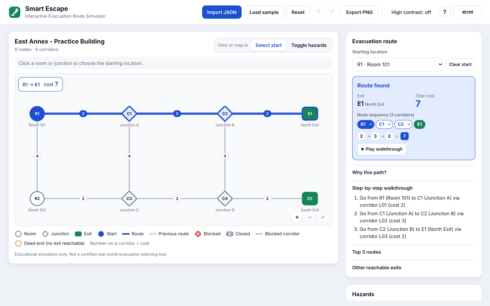
</div>

<div align="center">

| | |
|---|---|
| **Name** | `<your full name>` |
| **Registration number** | `261-15-001` |
| **Live link (HTTPS)** | [0xdevabir.github.io/smart-scape-mock](https://0xdevabir.github.io/smart-scape-mock/) |
| **Repository** | [github.com/0xdevabir/smart-scape-mock](https://github.com/0xdevabir/smart-scape-mock) |

</div>

---

## 🎯 The problem and how we answer it

| The problem | What Smart Escape does | Where to see it |
| --- | --- | --- |
| Paths go stale the moment a hazard changes | Dijkstra recalculates **synchronously** after every toggle | Map highlight · Route panel |
| Ties between equal-cost paths are ambiguous | Lexicographically smallest exit ID, then smallest node sequence | *Why this path?* · Tie screenshot |
| Invalid building files crash or silently lie | Strict §3.1 validation; bilingual error list; current map kept | Invalid-file screenshot |
| Judges need to verify §4.1 without a checklist | Built-in **Judge mode** runs the five sample checks through the real engine | Judge mode panel |
| Bangla users get English-only tools | Every label, status, error and walkthrough is translated; Bangla digits in BN mode | Bangla screenshot |

**Hero workflow:** open the app → brand intro plays → East Annex loads → click **R1** → see `R1 → C1 → C2 → E1` (cost 7) → block **C2** → the route flips to `R1 → C1 → C3 → C4 → E2` (cost 11) with a `7 → 11 (+4)` badge and a faint ghost of the old path.

---

## 🔁 How it works

### One click, start to finish

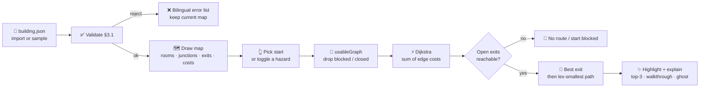

### What the user sees when a hazard flips

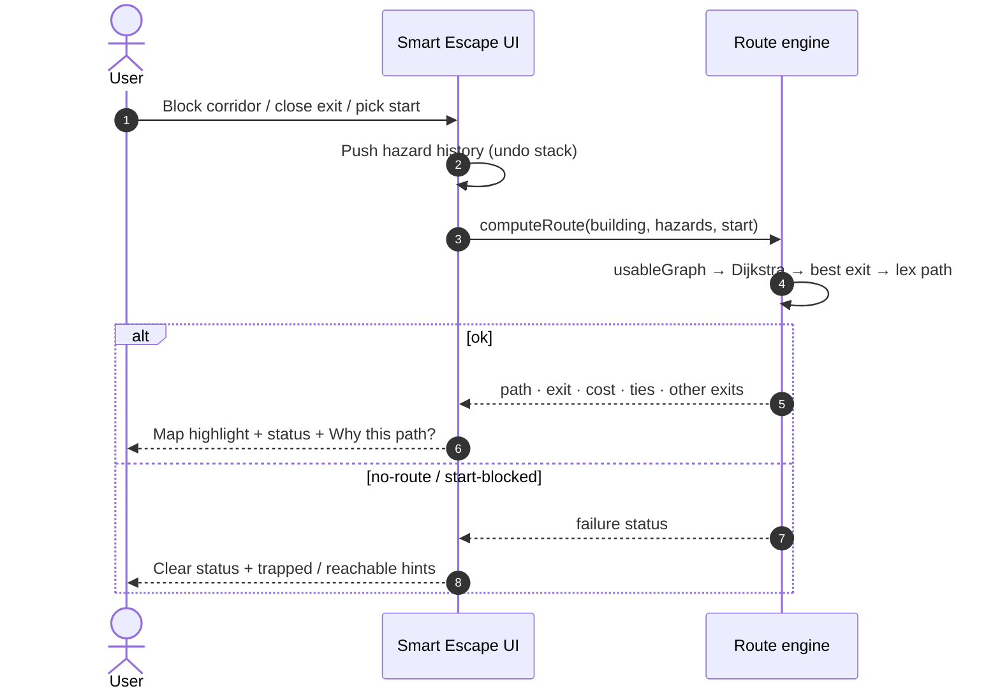

### Routing rules (§3.3) in `src/lib/route.ts`

1. Remove blocked nodes, closed exits, blocked edges, and every edge that touches a removed node. A closed exit is never used, even as an intermediate.
2. Run Dijkstra from the start using the **sum of edge costs**. Coordinates and hop counts are never used.
3. Pick the reachable open exit with the lowest cost. On a tie, pick the lexicographically smallest exit ID.
4. Among equal-cost paths to that exit, return the lexicographically smallest node sequence (second Dijkstra from the exit, then greedy walk preferring the smallest-ID neighbour on a shortest path).

Nothing is hard-coded: routes, IDs and positions all come from the imported file.

---

## ✅ Sample checks (§4.1)

Verified by unit tests **and** in the browser Judge mode.

| Scenario | Result |
| --- | --- |
| Select **R1** | `R1 → C1 → C2 → E1`, cost **7** |
| Select **R1**, block **C2** | `R1 → C1 → C3 → C4 → E2`, cost **11** |
| Select **R1**, close **E1** and **E2** | **No route available** |
| Select **R2** | `R2 → C3 → C4 → E2`, cost **7** |
| Select **R1**, then block **R1** | **Starting location blocked** |

**Tie example:** with C2 blocked, `R1 → C1 → C3 → C4 → E2` and `R1 → R2 → C3 → C4 → E2` both cost 11. The app picks the one through **C1**, because `C1` < `R2` at the first differing hop. *Why this path?* lists both and marks the chosen one.

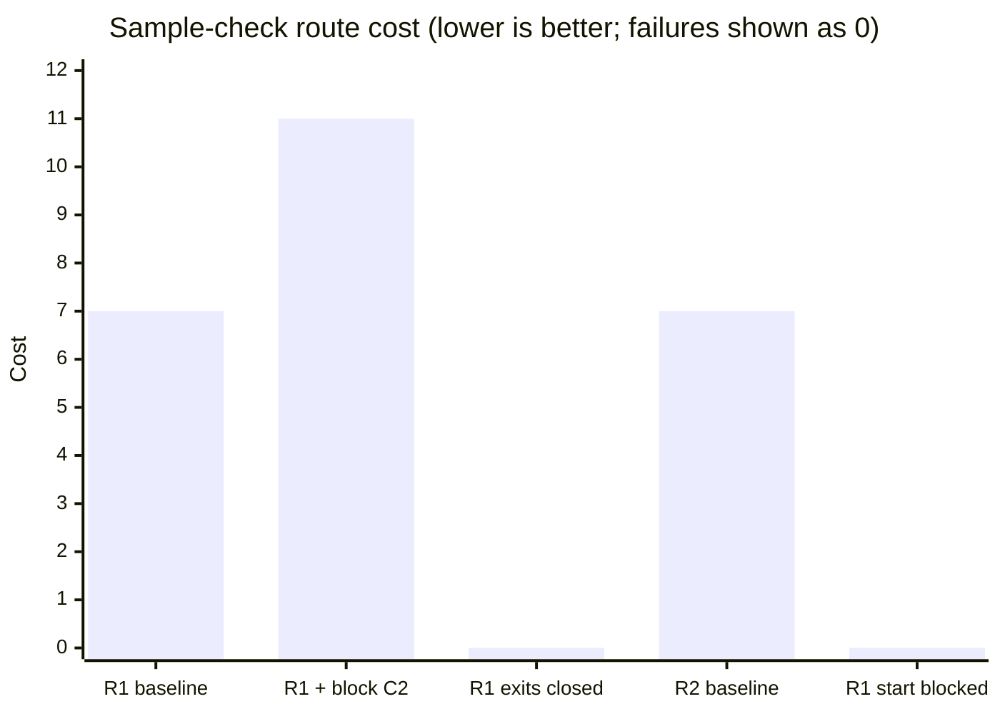

---

## 🖥️ Feature tour

<table>
<tr>
<td width="50%"><br/><b>Baseline.</b> Pick R1 and the cheapest exit lights up: <code>R1 → C1 → C2 → E1</code>, cost 7.</td>
<td width="50%">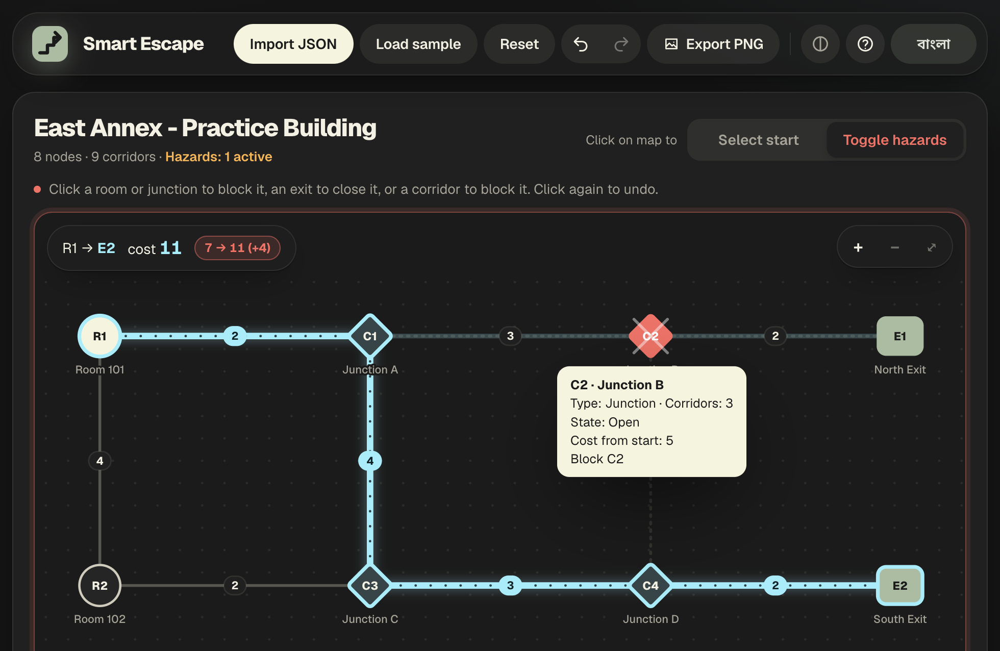<br/><b>Live reroute.</b> Block C2 and the path flips to E2 at cost 11, with a cost-delta badge and ghost of the old path.</td>
</tr>
<tr>
<td>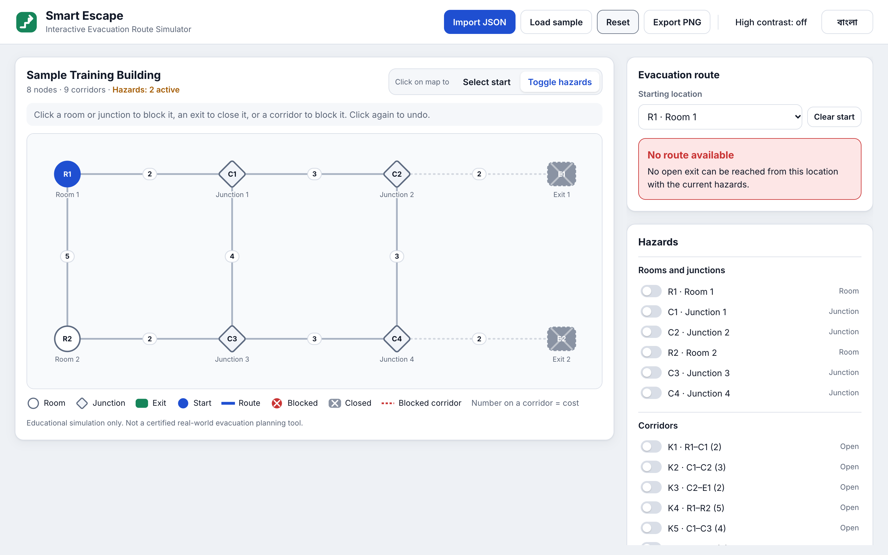<br/><b>No route.</b> Close E1 and E2 — status becomes <em>No route available</em> / <em>কোনো পথ পাওয়া যায়নি</em>.</td>
<td>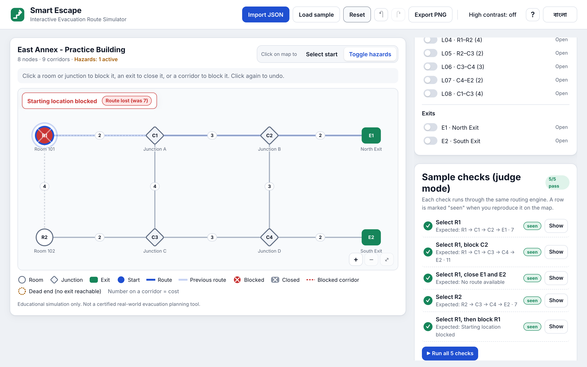<br/><b>Start blocked.</b> Block the starting room — clear bilingual failure, not a silent empty map.</td>
</tr>
<tr>
<td>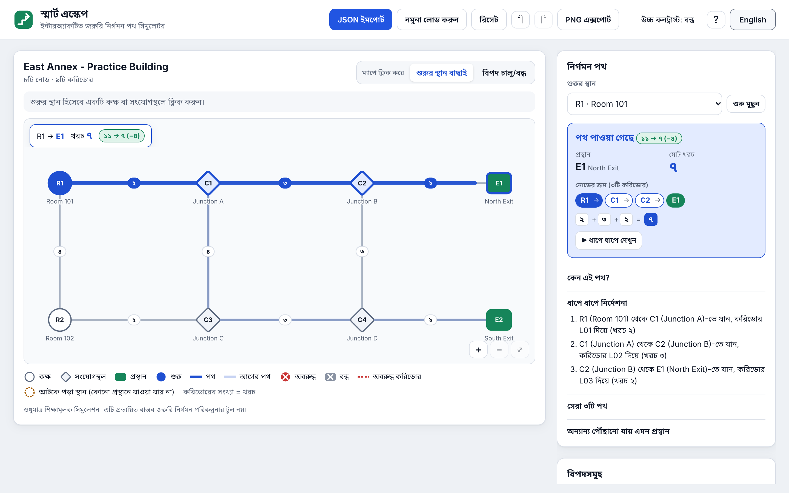<br/><b>বাংলা.</b> Full UI translation, including statuses, errors, help and Bangla digits.</td>
<td>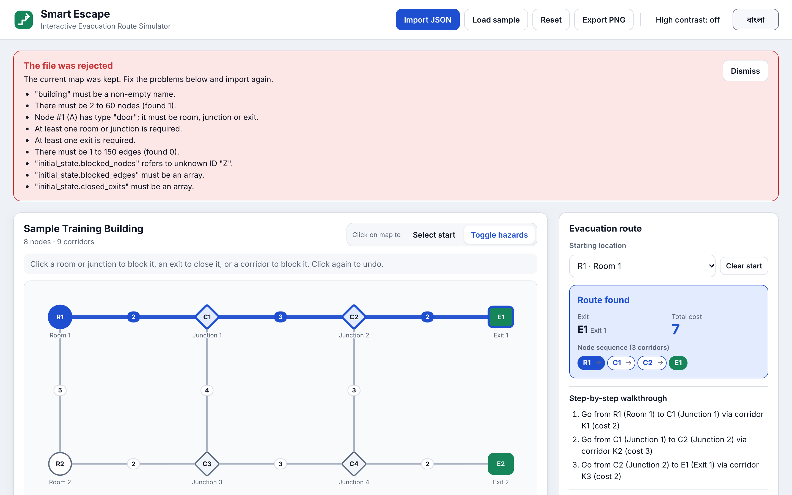<br/><b>Strict import.</b> A bad <code>building.json</code> shows every §3.1 violation; the current map stays.</td>
</tr>
<tr>
<td>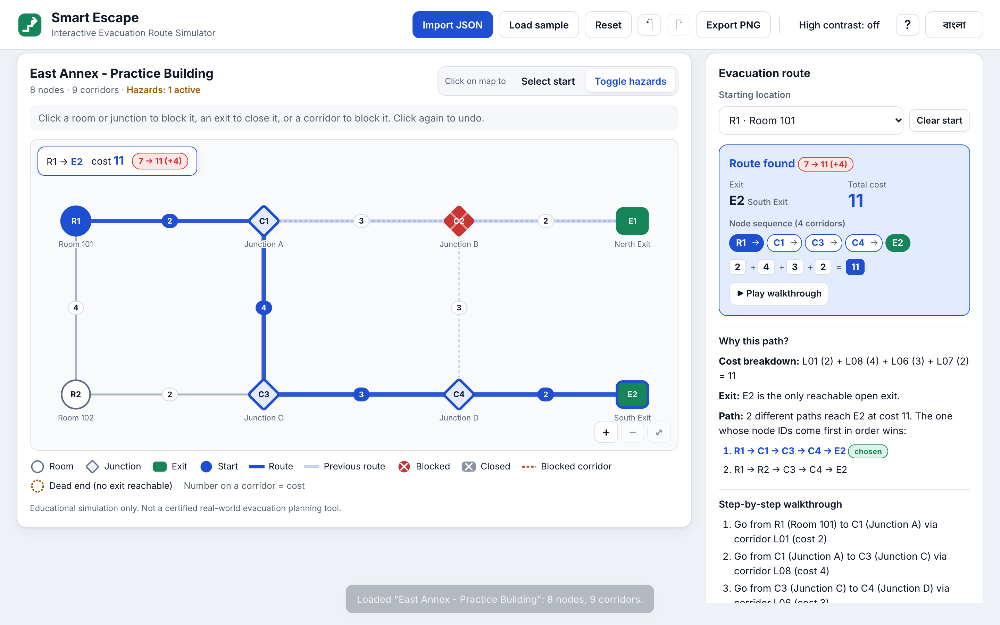<br/><b>Why this path?</b> Cost breakdown, exit-tie reason, and every equal-cost alternative marked.</td>
<td>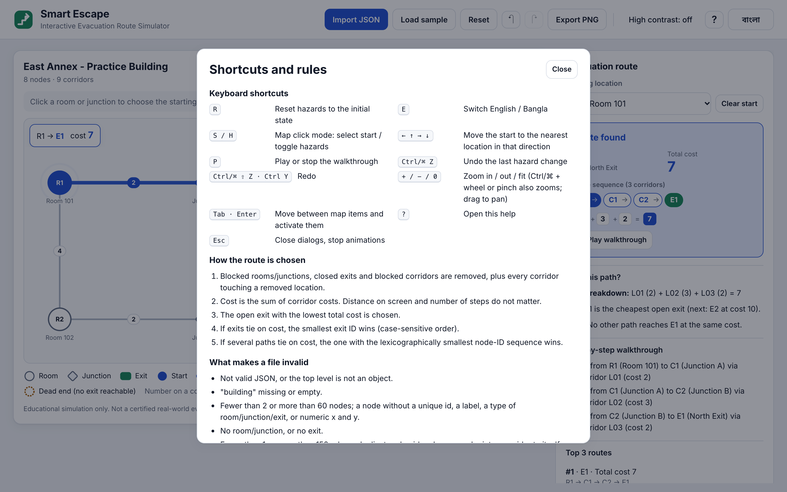<br/><b>Help.</b> Keyboard map, routing rules and validation catalog behind <b>?</b>.</td>
</tr>
<tr>
<td colspan="2">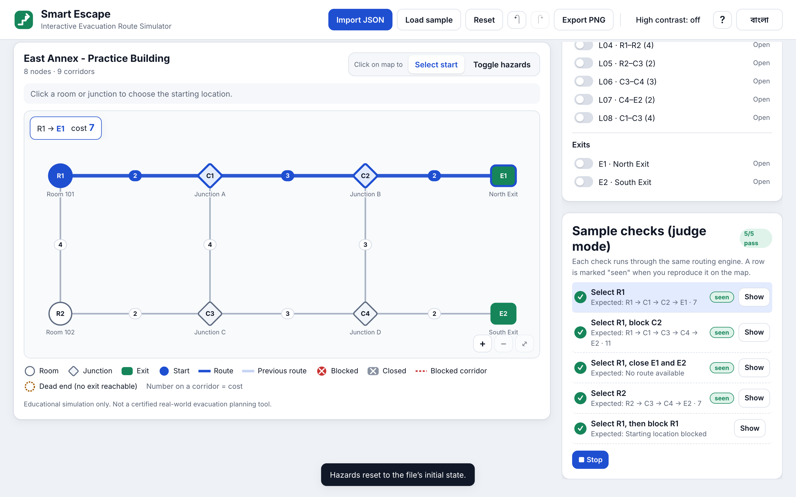<br/><b>Judge mode.</b> The five §4.1 checks run through the real engine — <b>Run all 5</b> plays them as a demo.</td>
</tr>
</table>

### Also built in

| Surface | What it does |
| --- | --- |
| **Animated intro** | Brand splash on load — logo assembles, path races, zoom reveal; respects `prefers-reduced-motion` |
| **Top 3 routes** | Yen-style k-shortest across open exits; hover/focus previews the path |
| **Walkthrough + Play** | Step list and a marker that walks the route |
| **What changed** | Previous route stays as a faint ghost; badge shows `7 → 11 (+4)` or *Route lost* |
| **Dead ends** | Nodes with no reachable exit get a dashed ring; panel names reachable areas |
| **Map HUD** | Start → exit · cost overlay; zoom/pan (`+` `−` `0`, Ctrl/⌘+wheel, drag) |
| **Undo / redo** | Hazard history; Reset restores `initial_state` and can itself be undone |
| **Accessibility** | High-contrast toggle, keyboard map + hazard switches, ARIA live status, `prefers-reduced-motion` |
| **PNG export / print** | Full map with the current route, even when zoomed |
| **Persistence** | Dataset, hazards, start, language and contrast in `localStorage` (re-validated on load) |

---

## 🏗️ Architecture

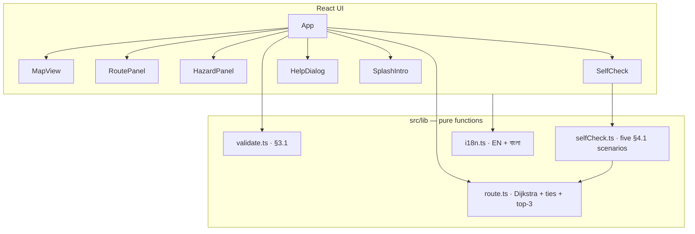

```
smart-escape/
├── public/building.json     # East Annex sample
├── docs/assets/             # README icon
├── screenshots/             # feature tour images
├── src/
│   ├── App.tsx              # state, shortcuts, persistence
│   ├── components/          # MapView · RoutePanel · HazardPanel · SelfCheck · Help · SplashIntro
│   └── lib/
│       ├── route.ts         # Dijkstra, ties, ranked routes, regions
│       ├── validate.ts      # strict building.json rules
│       ├── selfCheck.ts     # §4.1 scenarios
│       ├── i18n.ts          # English + Bangla
│       └── *.test.ts        # 40 unit tests
├── docs/PLAN.md
└── .github/workflows/deploy.yml
```

---

## ⚡ Run it in 3 commands

**Requirements:** Node 20.19+ (or 22.12+).

```bash
npm install
npm run dev       # http://localhost:5173
npm test          # 40 unit tests
```

```bash
npm run build     # static production build in dist/
npm run preview   # serve dist/ locally
```

The build is fully static (`base: './'`). Host `dist/` on GitHub Pages, Netlify, Vercel or Cloudflare Pages with no config. `.github/workflows/deploy.yml` deploys to GitHub Pages on every push to `main` — enable **Settings → Pages → Source: GitHub Actions**.

---

## 🎮 How to use

1. East Annex (`public/building.json`) loads automatically. **Import JSON** or drop a file anywhere to load your own.
2. With **Select start** on, click a room/junction or pick from the list — route, exit and cost appear immediately.
3. Switch to **Toggle hazards**: click a room/junction to block it, an exit to close it, or a corridor (or its cost label) to block it. Click again to undo. The Hazards panel mirrors the same switches for keyboard use.
4. **Reset** restores the file’s `initial_state`. **বাংলা / English** switches language. **↶ / ↷** undo and redo.
5. Press **?** for shortcuts, routing rules and the validation catalog.

**Keyboard:** `R` reset · `E` language · `S`/`H` mode · arrows move start (map focused) · `P` play · `Ctrl/⌘ Z` / `⇧Z` undo/redo · `+` `−` `0` zoom · `?` help.

---

## 🎬 Two-minute demo

| Time | Beat |
| --- | --- |
| **0:00** | Open the live link — animated brand intro, then East Annex and the map fill the viewport. |
| **0:20** | Click **R1** → route `R1 → C1 → C2 → E1`, cost 7. |
| **0:40** | Block **C2** → reroute to E2 at cost 11; show ghost path + delta badge. |
| **1:00** | Open *Why this path?* — cost breakdown and the C1-vs-R2 tie. |
| **1:20** | Switch to **বাংলা** — statuses and panel labels flip; digits become Bangla. |
| **1:35** | **Judge mode → Run all 5** — five §4.1 checks pass through the real engine. |
| **1:50** | Close: frontend-only, bilingual, explained routes that update on every hazard. |

---

## ⚠️ What this is not

> Educational simulation only. **Not** a certified real-world evacuation planning tool.

- No backend, no accounts, no telemetry — everything runs in the browser.
- Dataset labels and IDs stay as authored; only the UI chrome is translated.
- Judge mode appears only when the official East Annex sample graph is loaded.

---

## 🙏 Acknowledgments

Built for **AI DevFest Vibe Coding** (practice / mock test). Routing follows the published §3.3 rules; sample checks follow §4.1. Inspiration for this README’s structure: [FraudLens](https://github.com/0xdevabir/FraudLens) and [Emberfall / runtime-terrors](https://github.com/0xdevabir/runtime-terrors).
